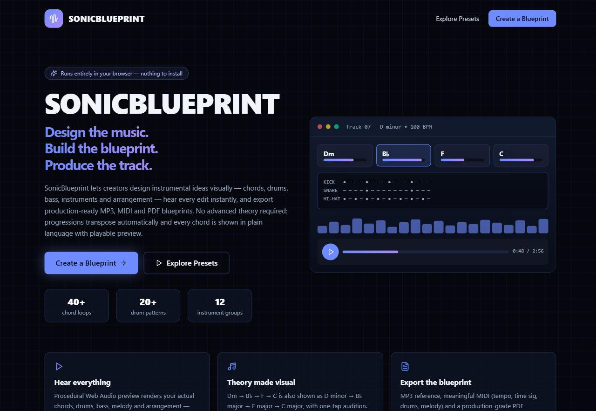
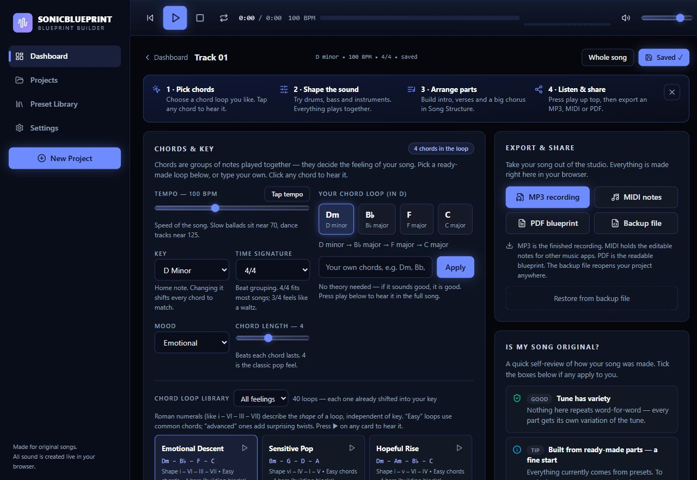
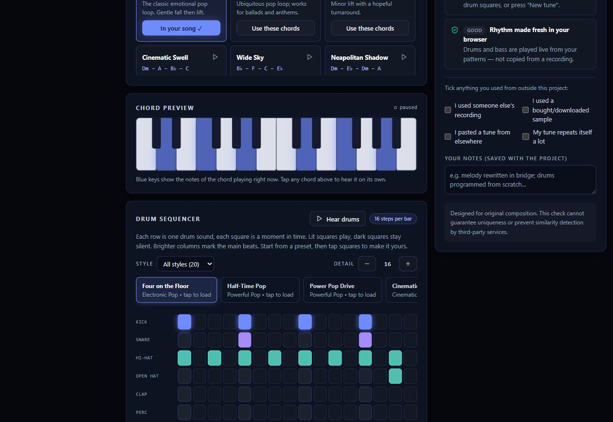

# SonicBlueprint

**Design the music. Build the blueprint. Produce the track.**

SonicBlueprint is a free, browser-based music composition and instrumental blueprint tool. It lets you design an instrumental idea visually — chords, drums, bass, instruments and song structure — hear every edit instantly, and take home MP3, MIDI and PDF blueprints. No account, no uploads, nothing to install.

New here? Start with the [User Guide](docs/user-guide.md) — creating, editing, exporting, backups and troubleshooting, all in plain language.

## Screenshots







## Key features

- 40 transposable chord loops, all major/minor keys, tap tempo, 4/4–12/8 time
- Visual drum step sequencer (20 patterns, swing, punch) with full keyboard operation
- Chord-following bass (8 styles + drawable rhythm), regenerable tunes (6 styles)
- 13 layerable instrument groups with mixer controls
- Mix Layers switches — Chords, Drums, Bass and Melody toggle on/off without losing settings; muted layers are excluded from preview, MP3 and MIDI, and marked muted in the PDF
- Song-structure timeline with per-part intensity, playable from any point
- Live preview (hybrid sampled/synthesized sound), undo/redo, and an unsaved-changes guard so work is never lost silently
- One-click MP3, MIDI, PDF and backup-file export
- Honest originality self-check (see [Originality](#originality))

## Music engine overview

`buildSongEvents(project)` in `src/lib/audio-engine.ts` is a pure function that expands a song into timed note and drum events: chords → notes, bass → root-following notes, drum grid → rhythm events, tune → generated melody events, instruments → synthesis layers, arrangement → the full timeline.

Both playback paths share it:

- **Realtime preview** schedules events with a lookahead scheduler on a single reused `AudioContext`, using licensed multisamples with synthesis fallback and sampled drum hits.
- **Offline export** renders the same events in short segments through `OfflineAudioContext` (with tail-overlap so long notes ring across boundaries), then encodes MP3 in-browser.

Events live on an integer quarter-note grid, so chord changes can never drift; performance feel (Exact / Subtle / Natural / Expressive) is shaped deterministically by the Human Performer engine (phrase arcs, groove, instrument profiles), so renders are deterministic.

## Chord and progression system

`src/data/chords.ts` holds 40 loops across 10 feeling categories, each with a Roman-numeral shape, difficulty and plain-language names (`Dm` is always shown as *D minor* too). Reference spellings plus a major/minor context let `resolvePresetChords()` shift any loop into the selected key, and every chip is tappable to hear it. Custom progressions can be typed freely, including sevenths (`Am7`, `G7`, `Cmaj7`).

## Drum sequencer

`src/components/DrumSequencer.tsx` renders 8 drum voices (kick, snare, hats, clap, percussion, toms, shaker) on an 8/12/16-step grid with swing and punch controls. Twenty `DRUM_PRESETS` in `src/data/drums.ts` cover electronic pop, rock, trap, cinematic, dance and ambient styles. The grid is a single Tab stop with arrow-key navigation and Space to toggle, and every preset remains fully editable.

## Bass system

Eight styles in `src/data/styles.ts` (`BASS_STYLES`) — steady roots, octave bounce, held notes, driving pulse, rolling arps, deep rumble, syncopated groove, plus a drawable rhythm grid — all generated from each chord's root, so the bass can never clash with the harmony.

## Melody system

`generateMelody()` in `src/lib/music-theory.ts` writes scale-aware tunes from the key, chords and a regenerable seed: ~55% chord tones for singability, stepwise scale motion otherwise. Six density styles range from minimal to decorated, and "New tune" keeps the chords while writing a fresh melody.

## Instrument system

Thirteen groups (`src/data/styles.ts`, `INSTRUMENT_DEFS`) can be layered simultaneously, each with enable switch, loudness, left–right placement, pitch range, job (chords, tune, ripple, background, bass, lead, texture), character and playing style. The engine renders every enabled slot, so duplicates stack intentionally.

## Arrangement system

`src/components/ArrangementTimeline.tsx` maps sections (intro, verse, pre-chorus, chorus, bridge, final chorus, outro…) with bar counts and per-part intensity, supporting add, delete (with undo), duplicate, reorder and tap-to-play-from-here. Energy shapes which layers sound: brass enters at 7+, tunes rest below 3.

## Audio preview

Transport controls (play/pause/stop/repeat, position, loudness, level meter) drive the lookahead scheduler; chord chips and the piano strip highlight the sounding chord live. Edits rebuild events instantly, and playback survives edits, pause/resume, section jumps and looping without drift or stuck notes.

## Export

| Format | Filename pattern | Contents |
|---|---|---|
| MP3 | `SonicBlueprint_<Name>_Instrumental.mp3` | 128 kbps stereo reference recording, rendered offline and encoded in-browser with progress |
| MIDI | `SonicBlueprint_<Name>.mid` | Chord, bass, drum and melody notes plus tempo and time signature — editable in any DAW |
| PDF | `SonicBlueprint_<Name>_Blueprint.pdf` | Readable production document: key, tempo, chords, rhythm, instruments, section timeline, notes |
| Backup (JSON) | `SonicBlueprint_<Name>.json` | The complete versioned project file; restore it on any device running the app |

Heavy encoder libraries load on demand, never on page open.

## Project persistence

Projects are versioned JSON (`schemaVersion: 4`, see format below; older files load with every layer switched on and an empty version history) stored in IndexedDB with a `localStorage` fallback. The editor keeps an undo/redo history, warns before leaving with unsaved changes, and validates every imported file structurally — malformed, absurd or oversized files are refused with a plain-language message and can never crash rendering or pollute storage.

```jsonc
{
  "schemaVersion": 4,
  "meta": { "id": "...", "name": "...", "createdAt": "...", "updatedAt": "...", "version": 1 },
  "config": { "bpm": 100, "keyTonic": "D", "scale": "minor", "timeSignature": "4/4", "mood": "Emotional", "energy": 6, "dynamics": 6, "humanize": "subtle" },
  "layers": { "chords": true, "drums": true, "bass": true, "melody": true },
  "chords": { "progressionId": "...", "chords": ["Dm", "Bb", "F", "C"], "beatsPerChord": 4, "octave": 3 },
  "drums": { "patternId": "...", "steps": 16, "grid": { "kick": [...], "...": [...] }, "swing": 0, "velocity": 0.9 },
  "bass": { "styleId": "root", "octave": 1, "volume": 0.85, "pattern": [...] },
  "melodyStyle": "gentle",
  "instruments": [{ "id": "...", "group": "piano", "enabled": true, "volume": 0.8, "pan": 0, "octave": 0, "role": "chords", "style": "soft", "patternVariant": "block" }],
  "arrangement": [{ "id": "...", "name": "CHORUS", "bars": 8, "energy": 8, "instruments": [] }],
  "originality": { "usesImportedRecording": false, "...": false, "melodySeed": "..." },
  "versions": [{ "id": "...", "label": "Bigger Chorus", "createdAt": "...", "versionNumber": 1, "snapshot": { /* full project minus versions */ } }]
}
```

## Architecture

```
src/app/            Routes: landing, dashboard, studio/[id], projects, presets, settings
                    + SEO files (metadata, robots, sitemap, manifest, OG image)
src/components/     One focused component per studio panel (chords, drums, bass,
                    instruments, timeline, transport, export, originality, …)
src/data/           Data-driven preset libraries (chords, drums, styles)
src/lib/            Pure logic: music theory, project schema, storage,
                    audio engine, MP3/MIDI/PDF export, originality checks
src/store/          zustand stores — editor state, playback state and
                    persistence are deliberately separated so audio ticks
                    never rerender the whole editor
tests/              Deterministic unit + integration suite (npm test)
qa/audio-qa.mts     Deterministic regression tests for the audio event pipeline
```

UI components never touch Web Audio directly — everything audible goes through the `WebAudioEngine` abstraction in `src/lib/audio-engine.ts`.

Presets are data, not UI: add entries to `src/data/chords.ts` (`CHORD_PROGRESSIONS`), `src/data/drums.ts` (`DRUM_PRESETS`) or `src/data/styles.ts` (`QUICK_STARTS`, `INSTRUMENT_DEFS`, `BASS_STYLES`, `MELODY_STYLES`, `MOODS`) and the interface picks them up with no component changes.

## Tech stack

- [Next.js 16](https://nextjs.org/) (App Router) · [React 19](https://react.dev/) · [TypeScript](https://www.typescriptlang.org/) (strict)
- [Tailwind CSS v4](https://tailwindcss.com/) · [zustand](https://zustand.docs.pmnd.rs/) (state) · [lucide-react](https://lucide.dev/) (icons)
- Sound: native [Web Audio API](https://developer.mozilla.org/en-US/docs/Web/API/Web_Audio_API) (hybrid sampled + synthesized audio, no backend)
- Export: [@breezystack/lamejs](https://www.npmjs.com/package/@breezystack/lamejs) (MP3) · [@tonejs/midi](https://github.com/Tonejs/Midi) (MIDI) · [jsPDF](https://github.com/parallax/jsPDF) (PDF)
- No database, no authentication, no server-side audio rendering.

## Local setup

Requirements: Node.js 20+ and npm.

```bash
npm install
npm run dev        # http://localhost:3000
```

## Development commands

```bash
npm run typecheck  # strict TypeScript check
npm run lint       # ESLint
npm test           # 246 unit + integration tests (deterministic core logic)
npx tsx qa/audio-qa.mts   # 67 audio-engine regression assertions
npm run build      # typechecks, then produces an optimized production build
npm start          # serve the production build locally (default port 3000)
```

## Vercel deployment

Designed for Vercel with zero configuration:

1. Push this repository to GitHub.
2. Import it in Vercel (framework preset: Next.js).
3. Deploy — `npm run build` works with no environment variables and no server functions.

Optional: set `NEXT_PUBLIC_SITE_URL` to your production domain so canonical URLs, sitemap and social cards point at it (they default to `https://sonicblueprint-studio.vercel.app`).

## Contribution instructions

Contributions are welcome — see [CONTRIBUTING.md](CONTRIBUTING.md) for setup, code style, audio-engine rules and the pull-request checklist. By contributing you confirm you have the right to share your work; if an open license is adopted later, contributions may be included under it (see [License](#license)).

## Limitations

- **Reference sounds, not mastered releases.** Preview and MP3 output are browser-rendered reference recordings (licensed multisamples with synthesis fallback) for songwriting and communication, not a substitute for recording, mixing and mastering.
- **Browser-only storage.** Projects live in the browser you created them in. Use backup files before switching devices or clearing site data.
- **No AI features.** Melodies and rhythms come from deterministic musical rules applied to your settings — there is no machine-learning model, and none is claimed.

## Originality

SonicBlueprint generates musical compositions and reference arrangements from the settings you choose. Its originality panel reviews how a song was made — flagging imported recordings, commercial samples, pasted tunes and heavy repetition — to help you keep your work your own.

It does not, and cannot, guarantee that third-party services will consider the resulting audio unique: no application can promise that an exported track will never resemble, or be flagged alongside, existing recordings. Always clear the rights to any outside material you bring into a project.

## License

No open-source license is granted with this repository at this time (all rights reserved). See [CONTRIBUTING.md](CONTRIBUTING.md) before submitting work.
